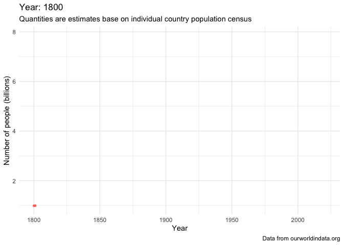

```{r setup, include=FALSE}
# style.css file is the same for the course slides.
# to run this file on RStudio you may have to increase available memory with command on console or modifying .Renviron file in your home directory, see for example https://stackoverflow.com/questions/1395229/increasing-or-decreasing-the-memory-available-to-r-processes

knitr::opts_chunk$set(eval = TRUE, include = TRUE, echo = FALSE)
```

## How change the population during time?

The primary goal of this presentation is to understand how the world population change depending on the time of observation and the country. It's interesting to know also the speed of population changing and the amount of people in the future. These goals can be summarized in the following points:

-   world population size;
-   by-country population;
-   population growth rate;
-   future predictions on population.

## Outline

-   world population today;
-   population by state;
-   population in the past;
-   population changing rate;
-   population in the future;
-   sources and citations.

```{r import_tidy, include=FALSE}
# load libraries
library(tidyverse)
library(modelr)
library(broom)
library(ggrepel)
library(gganimate)
library(ggstance)
library(shiny)

# import datasets, i import more datasets to compensate the small number of features/variables per dataset
pop <- read_csv("population-since-1800.csv")
regpop <- read_csv("world-population-by-world-regions-post-1820.csv")
pgr <- read_csv("population-growth-rates.csv")
pg <- read_csv("population-growth-the-annual-change-of-the-population.csv")
annual_number_of_births_by_world_region <- read_csv("annual-number-of-births-by-world-region.csv")
number_of_births_per_year <- read_csv("number-of-births-per-year.csv")


# tidy data on population sizes
# country/region population
pop <- pop %>% 
  select(-Code) %>% 
  rename(n = `Population (historical estimates)`)

# country population only
state_pop <- pop %>% 
  filter(Entity != "Africa", Entity != "America", Entity != "South America", Entity != "North America", Entity != "Europe", Entity != "Asia", Entity != "Oceania", Entity != "World") %>% 
  rename(State = Entity)

# region population only
region_pop <- pop %>% 
  filter(Entity == "Africa" || Entity == "America" || Entity == "South America" || Entity == "North America" || Entity == "Europe" || Entity == "Asia" || Entity == "Oceania")

# World population only
world_pop <- pop %>% 
  filter(Entity == "World")

# population since antiquity
past_pop <- regpop %>% 
  select(-Code) %>% 
  rename(n = `Population (historical estimates)`) %>% 
  filter(is.na(n) == FALSE)
```

```{r rate_tidy}
# tidy population rate
# population rate till 2020
pop_rate_perc_2020 <- pgr %>% 
  rename(perc2100 = `Medium fertility variant, 2020 - 2099: Annually interpolated demographic indicators - Population growth rate (percentage)`, perc2020 = `Estimates, 1950 - 2020: Annually interpolated demographic indicators - Population growth rate (percentage)`) %>% 
  select(-Code, -perc2100) %>% 
  filter(Year < 2021)

# population rate from 2021 to 2100
pop_rate_perc_2100 <- pgr %>% 
  rename(perc2020 = `Estimates, 1950 - 2020: Annually interpolated demographic indicators - Population growth rate (percentage)`,
         perc2100 = `Medium fertility variant, 2020 - 2099: Annually interpolated demographic indicators - Population growth rate (percentage)`) %>% 
  select(-Code, -perc2020) %>% 
  filter(Year > 2020)

# account for relevant groups of countries
regions <- c("Africa", "Asia", "Asia, Central", "Caribbean", "Central America", "Central and Southern Asia", "Eastern Asia", "Eastern Europe", "Eastern and South-Eastern Asia", "Europe", "Europe and Northern America", "Europe, Western", "Latin America and the Caribbean", "Middle Africa", "Northern Africa", "Northern Africa and Western Asia", "Northern America", "Northern Europe", "Oceania", "Oceania (excluding Australia and New Zealand)", "Southern Africa", "South America", "South Eastern Asia", "Southern Asia", "Southern Europe", "Sub-Saharan Africa", "Western Asia", "Western Africa", "World")
countries_by_develop <- c("Least Developed Countries", "Small Island Developing States (SIDS)", "More Developed Regions", "Less Developed Regions", "Less Developed Regions, excluding China", "Less Developed Regions, excluding Least Developed Countries", "Land-locked Developing Countries (LLDC)")
countries_by_income <- c("High income countries", "Low-income countries", "Lower-middle-income countries", "Middle-income countries", "No income group available", "Upper-middle-income countries")
groups <- regions %>% append(countries_by_develop) %>% append(countries_by_income)

# tidying pop_rate* into a single data_frame to have a single dataset for rates from 1950 to 2100
pop_rate_perc <- pop_rate_perc_2020 %>% 
  rename(perc = perc2020)
pop_rate_perc2 <- pop_rate_perc_2100 %>% 
  rename(perc = perc2100)
pop_rate <- union(pop_rate_perc, pop_rate_perc2) %>% 
  rename(entity = Entity, year = Year, rate = perc)

```

```{r births_tidy}
# another dataset on number of births, a significant variable that affect population
annual_number_of_births_by_world_region <- annual_number_of_births_by_world_region %>% 
  select(-Code) %>% 
  rename(Births = `Estimates, 1950 - 2020: Annually interpolated demographic indicators - Births (thousands)`)
# second data frame
number_of_births_per_year <- number_of_births_per_year %>% 
  select(-Code) %>% 
  rename(Births19502020 = `Estimates, 1950 - 2020: Annually interpolated demographic indicators - Births (thousands)`,
         Births20202099 = `Medium fertility variant, 2020 - 2099: Annually interpolated demographic indicators - Births (thousands)`) 
number_of_births_per_year1 <- number_of_births_per_year %>%
  select(-Births20202099) %>%
  filter(Year <= 2020) %>% 
  rename(Births = "Births19502020")
number_of_births_per_year2 <- number_of_births_per_year %>%
  select(-Births19502020) %>% 
  filter(Year > 2020) %>% 
  rename(Births = "Births20202099")
number_of_births_per_year <- 
  union(number_of_births_per_year1, number_of_births_per_year2)
```

## How many people are there in the world today?

Here, general information about world population.

```{r world_population}
num_people <- world_pop %>% 
  filter(Year == 2021) %>% 
  select(n)
world_population <- num_people[[1]]
world_population2 <- round(world_population/10^9, digits = 2)
```

Today, the world counts approximately `r world_population` people, about `r world_population2` billions.

```{r wp_plot_present}
world_pop %>% 
  filter(Year > 1950) %>% 
  ggplot(aes(Year, n/10^9)) +
  geom_point(aes(colour = Year, size = n), show.legend = FALSE) +
  labs(title = "World population from 1950 to today",
       subtitle = "Quantities are estimates base on individual country population census",
       caption = "Data from ourworldindata.org",
       x = "Year",
       y = "Population (billions)") +
  theme_minimal()
```

## How changed the number of people in the world in the last two centuries?

In the last two centuries, population growth had an exponential trend. In the first half of 1800 population grew of about 0.5 billions (50 years period of time). On the contrary, the last 50 years saw an increment of about 4 billions, a huge difference (eight times) in the same time interval.

```{r wp_graphic, message=FALSE}
world_pop %>% 
  ggplot(aes(Year, n/10^9)) +
  geom_line() +
  labs(title = "World population from 1800 to today",
       subtitle = "Quantities are estimates base on individual country population census",
       caption = "Data from ourworldindata.org",
       x = "Year",
       y = "Population (billions)") +
  theme_minimal()

p <- world_pop %>% 
  ggplot(aes(Year, n/10^9)) +
  geom_point(aes(size = n, color = "orange"), show.legend = FALSE) +
  labs(title = "World population from 1800 to today",
       subtitle = "Quantities are estimates base on individual country population census",
       caption = "Data from ourworldindata.org",
       x = "Year",
       y = "Population (billions)") +
  theme_minimal()

# gganimate code
ap <- p +
  labs(title = 'Year: {round(frame_time)}', x = 'Year', y = 'Number of people (billions)') +
  transition_time(Year) +
  ease_aes(default = 'linear') +
  shadow_wake(0.5, wrap = FALSE)
  # shadow_trail(alpha = alpha/2, colour = 'grey')

# gif output
gif_pop = animate(ap)
anim_save(filename =  "wp.gif")

# 
# # video output
# vp_pop = animate(ap, renderer = av_renderer())
# vp_pop

```



## What about individual countries?

Let's see how changed the population in individual countries.

```{r countries_pop}
state_pop %>% 
  ggplot(aes(Year, n/10^9)) +
  geom_line(aes(group = State, color = State), alpha = 1/5, show.legend = FALSE) +
  labs(title = "Countries population from 1800 to today",
       subtitle = "Quantities are estimates base on individual country population census",
       caption = "Data from ourworldindata.org",
       x = "Year",
       y = "Population (billions)") +
  theme_minimal()
```

Here we can see there are two countries, outliers, with more than a billion people today and have a very big margin than all the others countries. These correspond to:

```{r most_populated_states}
most_pop_state <- state_pop %>% 
  filter(!is.na(n)) %>% 
  filter(Year == 2021) %>% 
  arrange(desc(n)) %>% 
  head(2)
```

-   `r most_pop_state[[1]][[1]]` with `r most_pop_state[[3]][[1]]/10^9` and
-   `r most_pop_state[[1]][[2]]` with `r most_pop_state[[3]][[2]]/10^9` billions of people.

Furthermore, it can be seen that India has a growth faster than China. Although today India has less people than China, it is expected that in the future, India will become the most populous country in the World (perhaps, just in this decade).

## What about specific countries?

Here, let's show how population grew in individual countries like Italy.

```{r country_specific_plot}
# a function to plot information about a country for a given period of time
poplot <- function(state, year1, year2) {
  state_pop %>% 
  filter(State == state, Year >= year1, Year <= year2) %>%
  ggplot(aes(Year, n/10^6)) +
  geom_line(alpha = 0.5, show.legend = FALSE) +
  scale_size(range = c(2, 20)) +
  scale_x_log10() +
  labs(title = paste(state, year1, "-", year2),
       subtitle = "Quantities are estimates base on individual country population census",
       caption = "Data from ourworldindata.org",
       x = "Year",
       y = "Population (millions)") +
  theme_minimal() 
}

poplot("Italy", 1800, 2020)
```

## Interactive visualization

```{r shiny_plot}
# Define UI for application that draws the plot
ui = fluidPage(
   
   # Application title
   titlePanel("Country-specific population"),
   
   # Sidebar with a slider input for number of bins 
   sidebarLayout(
      sidebarPanel(
        # Input object: a slider called bins 
        sliderInput("slider",
                     h3("Year range:"),
                     min = 1800,
                     max = 2020,
                     value = c(1850, 1950)),
        textInput("text", h3("Country input"))
      ),
      
      # A reactive output object: a plot with name pointPlot
      mainPanel(
         plotOutput("pointPlot")
      )
   )
)

# Define server logic required to draw the plot
server <- function(input, output) {
   
  # render the reactive output with name pointPlot 
  output$pointPlot <- renderPlot({
      # draw the plot with the specified year-range and country
      poplot(input$text, input$slider[1], input$slider[2])
   })
}

# Run the application 
shinyApp(ui = ui, server = server)

```

## What's the trend starting from the antiquity?

```{r world_past_pop}
past_pop %>% 
  filter(Entity=="World") %>% 
  ggplot(aes(Year, n/10^9)) +
  geom_line(aes(group = Entity)) +
  geom_vline(xintercept = 1800, color = "red", size = 1) +
  scale_x_continuous(breaks = seq(-10000, 2500,by = 1000)) +
  labs(title = "World population from the antiquity to today",
       subtitle = "Quantities are estimates base on individual country population census",
       caption = "Data from ourworldindata.org",
       x = "Year",
       y = "Population (billions)") +
  theme_minimal()
```

This isn't very informative, it only tells that thousands of years ago there were much less people than today and in the last few centuries world population grew a lot!

The exponential population growth of the last few centuries (i.e. from about 1800) may be caused by two main events:

* the Renaissance;
* Industrial Revolution.

## How did population grow in individual countries?

Let's try to fit a model for a single country like United States. 

The objective of this and further linear models is to evidence a trend/pattern between year and population size or rate as a predictive model. If a year or period of time, data on population isn't kept then the model can predict a value for this period of time from the data already collected.

```{r us_model}
#{r us_model, out.width = "33%", fig.asp = 1, fig.width = 3, fig.align='default'}
us <- filter(state_pop, State == "United States")
us %>% 
  ggplot(aes(Year, n/10^6)) + 
  geom_line() + 
  ggtitle("Full data") +
  labs(y = "Millions of people") +
  theme_minimal()

us_mod <- lm(n ~ Year, data = us)
us %>% 
  add_predictions(us_mod) %>%
  ggplot(aes(Year, pred/10^6)) + 
  geom_line() + 
  ggtitle("Linear trend") +
  labs(y = "Prediction (mln)") +
  theme_minimal()

us %>% 
  add_residuals(us_mod) %>% 
  ggplot(aes(Year, resid/10^6)) + 
  geom_hline(yintercept = 0, colour = "white", size = 3) + 
  geom_line() + 
  ggtitle("Remaining pattern") +
  labs(y = "Residual (mln)") +
  theme_minimal()
```

## How did population grow in individual countries?

Let's try generate a model for a single country like Italy.

```{r italy_model, out.width = "33%", fig.asp = 1, fig.width = 3, fig.align='default'}
it <- filter(past_pop, Entity == "Italy")
it %>% 
  ggplot(aes(Year, n/10^6)) + 
  geom_line() + 
  ggtitle("Full data") +
  labs(y = "Millions of people") +
  theme_minimal()

it_mod <- lm(n ~ Year, data = it)
it %>% 
  add_predictions(it_mod) %>%
  ggplot(aes(Year, pred/10^6)) + 
  geom_line() + 
  ggtitle("Linear trend") +
  labs(y = "Prediction (mln)") +
  theme_minimal()

it %>% 
  add_residuals(it_mod) %>% 
  ggplot(aes(Year, resid/10^6)) + 
  geom_hline(yintercept = 0, colour = "white", size = 3) + 
  geom_line() + 
  ggtitle("Remaining pattern") +
  labs(y = "Residual (mln)") +
  theme_minimal()
```

From the chart of Italy growth, it can be seen that there's an unusual pattern between year zero and year 1750. Let's focus on that area.

```{r past_specific_italy_model}
it <- filter(past_pop, past_pop$Entity == "Italy", between(Year, 0, 1750))
it %>% 
  ggplot(aes(Year, n/10^6)) + 
  geom_line() + 
  ggtitle("Full data") +
  labs(y = "Population (mln)") +
  theme_minimal()

it_mod <- lm(n ~ Year, data = it)
it %>% 
  add_predictions(it_mod) %>%
  ggplot(aes(Year, pred/10^6)) + 
  geom_line() + 
  ggtitle("Linear trend") +
  labs(y = "Prediction (mln)") +
  theme_minimal()

it %>% 
  add_residuals(it_mod) %>% 
  ggplot(aes(Year, resid/10^6)) + 
  geom_hline(yintercept = 0, colour = "white", size = 3) + 
  geom_line() + 
  geom_vline(colour = "red", size = 2, xintercept = 476) + 
  geom_vline(colour = "red", size = 2, xintercept = 1300) + 
  ggtitle("Remaining pattern") +
  labs(y = "Residual (mln)") +
  theme_minimal()
```

From this chart it's clear that some reasons for this unexpected behavior are:

* the fall of Western Roman Empire in 476 A.D. and
* epidemics and famines in the Middle Ages.

## What's the trend for each country?

Here, the objective is to compute a model for all countries and show which of these best fit and worst fit to the model.

```{r forall_model, warning=FALSE, message=FALSE, error=FALSE}
by_country <- state_pop %>% 
  group_by(State) %>% 
  nest()

# function that apply a linear model with year as independent variable and population size (n) as dependent variable
country_model <- function(df) {
  lm(n ~ Year, data = df)
}

by_country <- by_country %>% 
  mutate(model = map(data, country_model))

# # Show an example
# by_country %>% 
#   filter(State == "United States")

# by_country %>% 
#   arrange(State)

# add residuals
by_country <- by_country %>% 
  mutate(data = map2(data, model, add_residuals))

# unnest statistics and force the dropping of alternative list-columns with .drop
resids = unnest(by_country, data, .drop = TRUE)

resids %>% 
  ggplot(aes(Year, resid/10^6)) +
  geom_line(aes(group = State), alpha = 1 / 3) + 
  theme_minimal() + 
  labs(title = "Residuals for all countries",
       caption = "Data from ourworldindata.org",
       x = "Year",
       y = "Residual (mln)")

```

```{r statistics, warning=FALSE, message=FALSE, error=FALSE}
# add statistics
by_country <- by_country %>% 
  mutate(glance = map(model, broom::glance))

# unnest statistics and force the dropping of alternative list-columns with .drop
glance = unnest(by_country, glance, .drop = TRUE)

# bad_fit <- filter(glance, r.squared < 0.25)
# 
# state_pop %>% 
#   semi_join(bad_fit, by = "State") %>% 
#   ggplot(aes(Year, n, colour = State)) +
#     geom_line() +
#     theme_minimal()


bad_fit <- filter(glance, r.squared < 0.30)

state_pop %>% 
  semi_join(bad_fit, by = "State") %>%
  filter(Year > 1950) %>% 
  ggplot(aes(Year, n/10^6, colour = State)) +
    geom_line() +
    theme_minimal() +
    labs(y = "Population (mln)",
       caption = "Data from ourworldindata.org",
       title = "Countries that worst fit the model")

good_fit <- filter(glance, r.squared > 0.98)

state_pop %>% 
  semi_join(good_fit, by = "State") %>% 
  filter(Year > 1950) %>% 
  ggplot(aes(Year, n/10^6, color = State)) +
  geom_line(aes(group = State)) +
  theme_minimal() +
  labs(y = "Population (mln)",
       caption = "Data from ourworldindata.org",
       title = "Countries that best fit the model")

```

## How fast is the population growing?

Here, the purpose is to analyse the rate of population growing and its relationship with the actual number of people (population).

> Definition (annual population growth rate): The annual average rate of change of population size, for a given country, territory, or geographic area, during a specified period.

The growth rate is the percentage of the ratio between annual population increase and total population size. The increase is the sum of:

-   difference between births and deaths;
-   difference between immigrants and emigrants.

That is refereed to an entity, like a country, region or the entire world, in a specific period of time.

```{r present_rate}
pop_rate_perc_2020 %>% 
  group_by(Year) %>% 
  summarise(n = mean(perc2020)) %>% 
  ggplot(aes(Year,n)) +
  geom_line() +
  labs(title = "Population growth rate since 1950",
       subtitle = "Data resulting from the mean of various countries rates",
       caption = "Data from ourworldindata.org",
       x = "Year",
       y = "Rate") + 
  theme_minimal()

# today overall rate
value_tb1 <- pop_rate_perc_2020 %>% 
  filter(Year == 2020) %>% 
  summarise(mean(perc2020))

#value_tb1[[1]]

value_tb <- pop_rate_perc_2100 %>% 
  filter(Year == 2022) %>% 
  summarise(mean(perc2100))

#value_tb[[1]]

# pop_rate_perc_2020 %>%
#  group_by(Year) %>%
#  summarise(mean(perc2020)) %>%
#  ggplot(aes(Year, `mean(perc2020)`)) +
#  geom_line()

# Italy's 2020 rate
italy_today_rate <- pop_rate_perc_2020 %>% 
  filter(Entity == "Italy" & Year == 2020)

rate1962 <- pop_rate_perc_2020 %>% 
  filter(Year == 1962) %>% 
  summarise(n = mean(perc2020))
```

World population reached a peak in 1962 with a growing rate of `r rate1962[[1]]`.

This year the world population is still growing because the mean growing rate is `r value_tb[[1]]`. Population is growing slowly with respect to past decades and this can be seen from the chart where there's the mean of rate in the last 70 years. The population over the years is growing more and more slowly because the growth rate is decreasing.

## What are the causes of the growth?

World population growth depends on two factors:

* number of births;
* number of deaths.

To understand world population growth, it's straightforward to investigate these two factors upon which the growth depends on. Perhaps births and deaths are affected by:

* increasing life expectancy;
* falling child mortality.

These two alone would correspond to an increase in population. In reality, another term to keep particularly attention to is falling fertility rate, which seem to drive the population growth and determine its deceleration to 0% (indeed, in many countries, low fertility rate brought population growth rate to negative values, which corresponds to a shrink in population, as it can be seen from the chart of growth rate by country).

```{r births_today}
births_today <- number_of_births_per_year %>% filter(Entity == "World", Year == 2022)

births_past <- number_of_births_per_year %>% 
  filter(Entity == "World", Year == 1950)

```

Today, there are about `r births_today[[3]]/10^6` million births each year against `r births_past[[3]]/10^6` million births in 1950. 

```{r births_plot}
annual_number_of_births_by_world_region %>% 
  filter(Entity %in% c("Europe", "South America", "Northern America", "Asia", "Africa", "Oceania"), Year == 2020) %>% ggplot(aes(Births/10^6, Entity)) + 
  geom_point() +
  ggtitle("Number of births by region in 2020") +
  labs(x = "Births (millions)",
       y = "Continent")
```

If the number of deaths per year approaches the number of births per year (approximately, around 2100) then world population growth will come to an end.

## How to explain population growth?

The reduction of births may be explained in a decreasing fertility due to modern socio-economic changes like structural changes to the economy and a rise of the status and opportunities for women.

The demographic transition is a model that try to explain rapid population growth, depending on mortality and fertility changes and the time of observation. The five stages of demographic transition are:

1. high mortality and high birth rates: there is no or small population growth;
2. mortality falls but birth rates still high: here, the size of the population starts to grow rapidly;
3. mortality low and birth rates fall: the rate of population growth begins to decline;
4. mortality low and birth rates low: rapid population growth come to an end;
5. mortality low and some evidence of rising fertility: here, the fertility may rise again, depending on this the population can grow or decrease.

## Other factors that modify the growth

Another variable to observe is the level of development. In particular, as a country gets richer (i.e. more developed), fertility rates tend to fall.

```{r develop_rate_plot}
pop_rate %>% 
  filter(entity == "More Developed Regions" | entity == "Less Developed Regions" | entity == "Least Developed Countries") %>% 
  ggplot(aes(year, rate, color = entity)) + 
  geom_line() +
  theme_minimal() +
  labs(title = "Rate of population growth by region based on development",
       x = "Year",
       y = "Rate")
```

However, from the plot above it seems that all countries from more developed to least developed experienced a decrease in the growth rate in the last years. Furthermore, predictions till 2099 say that rates will continue to fall for all countries independent of development level.

Population momentum is the situation in which population can keep growing even if the fertility rate is falling. This is due to the number of women in the reproductive age bracket, if this number is high then the number of children in the world will not decline as rapidly as the fertility rate.

Another factor to keep in mind is the longer life expectancy of people WRT the past.

Also, at country/region level, migration contribute to determine the population growth. If a country or region experience a period of large immigration then the growth will be greater. On the contrary, with emigration the growth of a country population will be lower if not decreasing.

## To summarise the factors that affect population growth

Based on what we saw previously, we can think that the variables that influence world or country population growth are:

* fertility rate (children per woman): it's the main factor that affect population, it follows that the more children a woman has the more population will increase (however, it's projected that in the future world will reach 'peak child', the moment when the number of children in the world will stop increase);
* mortality rate: this is another important factor because if it is high than population decelerate or stop increase, fortunately today this factor is relatively low;
* development status: as can be seen from the previous chart a high development level contributes to brake population growth, indeed least developed countries has a higher growth rate than more developed countries;
* migration: this variable affect individual country population and in some cases determines the increase or decrease in the number of people in a specific country, in turn this can be connected to people who prospect better life conditions in another country than the one where they actually are;
* education: this factor affect population growth in such a way that if countries continue to develop education and open new schools then people will be more motivated to continue study and this means that the growth rate will decrease, especially if women will improve their education;
* life expectancy: the improved life expectancy is another factor that affects the growth because intuitively if people live a longer life (at the same births rate) then population will grow, but it can be that on the contrary people with a relatively high life expectancy don't think to have children because they don't feel the necessity of it, so population could remain the same with a higher average age.

## What will happen to world population in the future?

What will be the number of people in the future? How will change world population in the next years/decades? At what pace population will change? Will world population increase forever?

```{r future_population}
pop_rate_perc_2100 %>% 
  filter(Entity == "World") %>% 
  ggplot(aes(Year,perc2100)) + 
    geom_line() +
  labs(title = "Forecasts on rate of population growth from 2022",
       subtitle = "Data resulting from an overall summary of statistics",
       caption = "Data from ourworldindata.org",
       x = "Year",
       y = "Rate") + 
  theme_minimal()

```

In the next years, world population growth rate will decrease, this means that population will increase in number but slowly than before. It can be seen that predictions estimate a slow decreasing of world growth rate in the next decades. This means that:

1.  population is still increasing in number because the rate is positive;
2.  population will grow more and more slowly because the rate is decreasing;
3.  if the rate will reach zero at about year 2100, then population will remain constant in number;
4.  finally, if the rate will become negative, then population will begin to decrease, inevitably.

## How will the growth rate of population change in the future?

```{r region_rate}
# Rate
pop_rate_perc2 %>% 
  filter(Entity %in% regions) %>% 
  ggplot(aes(Year,perc,color=Entity)) +
  geom_line(show.legend = FALSE) +
  geom_ref_line(1, colour = "red") +
  labs(title = "Growth rate of world regions",
       subtitle = "Data based on United Nations (UN) projections",
       caption = "Data from ourworldindata.org",
       x = "Year",
       y = "Rate") +
  theme_minimal()
```

From the plot it can be seen that before 2100 all regions of the world will have a rate less than 1, this means that *no* region will increase its population faster then before.

```{r income_rate}
# Income
income_country_df <- pop_rate_perc2 %>% 
  filter(Entity %in% countries_by_income, Year == 2099)

pop_rate_perc2 %>% 
  filter(Entity %in% countries_by_income) %>% 
  ggplot(aes(Year,perc,color=Entity)) +
  geom_line() +
  labs(title = "Growth rate of countries based on income",
       subtitle = "The gross national income (GNI), previously known as gross national product (GNP), is the total \ndomestic and foreign output claimed by residents of a country, consisting of gross domestic \nproduct (GDP), plus factor incomes earned by foreign residents, minus income earned in the \ndomestic economy by nonresidents.",
       caption = "Data from ourworldindata.org",
       x = "Year",
       y = "Rate") +
  theme(legend.position = 'bottom')
# Gross National Income (GNI) is the total amount of money earned by a nation's people and businesses
```

This plot, about growth rate of countries by income, shows how low-income countries have a relatively high growth rate than high-income countries, for example, in 2020. However, this difference is going to reduce with time because low-income countries will see their growth rate go down and the one of high-income countries will remain approximately the same.

```{r develop_rate}
# Develop
develop_country_df <- pop_rate_perc2 %>% 
  filter(Entity %in% countries_by_develop, Year == 2030)

pop_rate_perc2 %>% 
  filter(Entity %in% countries_by_develop) %>% 
  ggplot(aes(Year,perc,color=Entity)) +
  geom_line(show.legend = FALSE) +
  geom_label_repel(data = develop_country_df,
                   mapping = aes(label = Entity),
                   show.legend = FALSE,
                   alpha = 0.5) +
  labs(title = "Growth rate of regions based on development",
       subtitle = "Data based on United Nations (UN) projections",
       caption = "Data from ourworldindata.org",
       x = "Year",
       y = "Rate") +
  theme_minimal()
```

Finally, in this chart of the series, the one about countries/regions by development status, the plot shows a similar situation of the previous one, here least-developed countries start from a growth rate above two and go down to one half in the next 80 years. On the contrary, more-developed regions will remain with the same growth rate, around zero. It's interesting to notice how China alone can reduce significantly the growth rate of less-developed regions. This because China has a particular control over population (e.g. China's family planning policies). An example of such policies is *one-child policy*, an official program initiated in the late 1970s and early '80s by the central government of China, the purpose of which was to limit the great majority of family units in the country to one child each. The rationale for implementing the policy was *to reduce the growth rate* of China's enormous population.

## What is the pattern of world growth rate in the next 80 years?

World population growth depends on two metrics:

-   number of births;
-   number of deaths.

That is, at global level births and deaths determine the increase or decrease of population. It's straightforward that when the number of deaths approaches the number of births, world population growth will come to an end.

```{r future_rate_model}
# reg_rate_perc <- pop_rate_perc2 %>% 
#   filter(Entity %in% regions)
reg_rate_perc <- pop_rate_perc2 %>% 
  filter(Entity == "World")

reg_rate_mod <- lm(perc ~ Year, data = reg_rate_perc)

reg_rate_perc <- reg_rate_perc %>% add_predictions(reg_rate_mod)
reg_rate_perc <- reg_rate_perc %>% add_residuals(reg_rate_mod)

# Predictions
# reg_rate_perc %>% 
#   ggplot(aes(Year, pred)) +
#   geom_line()
reg_rate_perc %>% 
  ggplot(aes(Year)) +
  geom_line(aes(y = perc), color = "blue") +
  geom_line(aes(y = pred), color = "red") +
  labs(title = "Global growth rate (blue line) and pattern (red line) in the future",
       subtitle = "Data based on United Nations (UN) projections",
       caption = "Data from ourworldindata.org",
       x = "Year",
       y = "Rate") +
  theme_minimal()

# Residual
reg_rate_perc %>% 
  ggplot(aes(Year)) +
  geom_line(aes(y = resid), color = "green") +
  labs(title = "Global growth rate residual",
       subtitle = "Data based on United Nations (UN) projections",
       caption = "Data from ourworldindata.org",
       x = "Year",
       y = "Residual rate") +
  theme_minimal()
  
```

In the future of population, the rate of population growth will turn negative, this means that there will be no increase in population and on the contrary, population may decrease in number.

The causes of this deceleration may be searched in the impact on environment of a large population and the reduced resources and food but also in the longer life expectancy (deriving from an improved health) and the higher cost of living.

If in the past the factor that check population growth was the mortality, it seems that in the future will be very low fertility that will control population changes.

## Sources and Citations

-   [Our world in data](https://ourworldindata.org/world-population-growth);
-   [United Nations Population Database](http://esa.un.org/unpd/wpp/);
-   Max Roser, Hannah Ritchie and Esteban Ortiz-Ospina (2013) - "World Population Growth". Published online at [OWID](OurWorldInData.org). Retrieved from: [Online Resource](https://ourworldindata.org/world-population-growth);
-   [Wikipedia](https://en.wikipedia.org/wiki/Population_growth#Population_growth_rate);
-   [World Health Organization](https://www.who.int/data/gho/indicator-metadata-registry/imr-details/1120).
-   [Future population growth](https://ourworldindata.org/future-population-growth)


